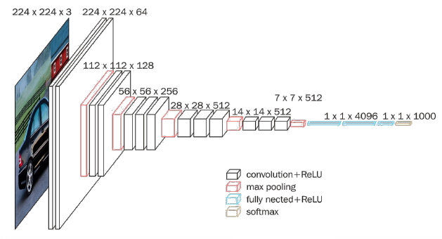

## 一、LeNet网络

卷积网络开篇之作。

特点：共享卷积核，减少网络参数。

## 二、AlexNet网络

激活函数使用[Relu](激活函数.md)提高训练速度。

Dropout防止过拟合。

## 三、VGG网络

小卷积核减少参数，提高识别准确率。

网络结构规整，适合并行加速。

## 四、Inception网络

一层内使用不同尺寸的卷积核，提升感知力（通过padding实现输出特征面积一致）。

使用 1\*1 卷积核，改变输出特征channel数（减少网络参数）

## 五、ResNet网络

层间残差跳连，引入前方信息，减少梯度消失是神经网络层数变深成为可能。
