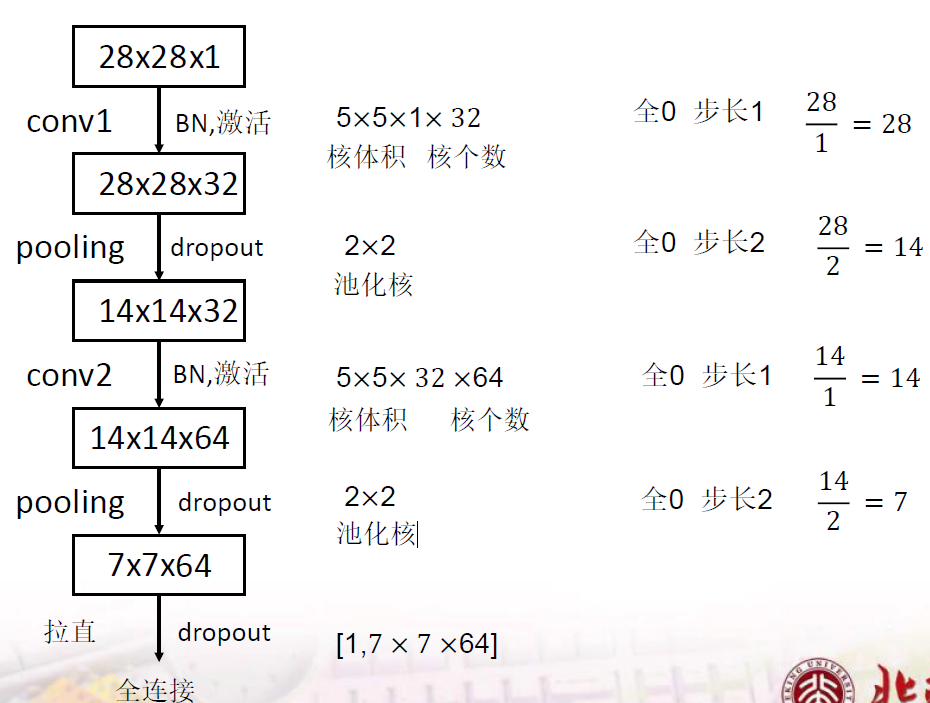
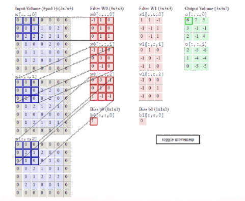
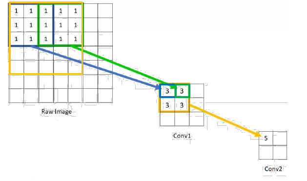
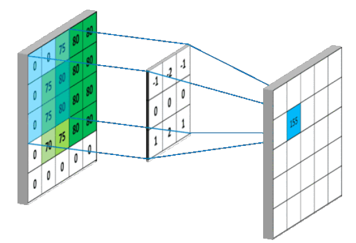
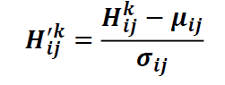
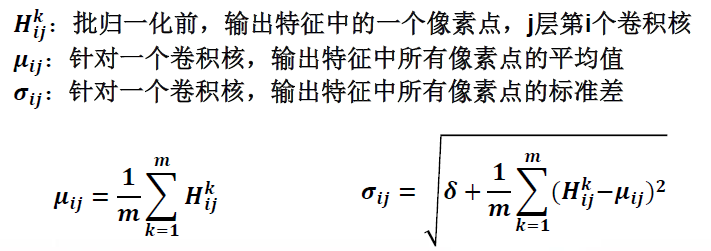
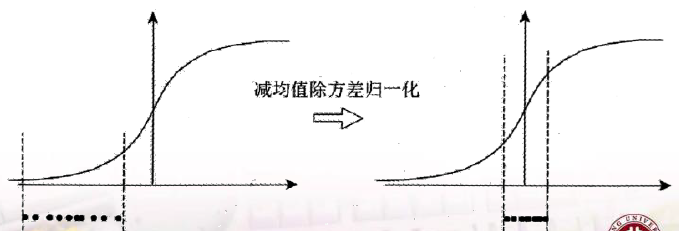
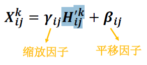

# 卷积神经网络
对于RGB图片，因为待优化参数过多，如果使用全连接会导致模型过拟合。对全连接进行改进->卷积神经网络（CNN）对原始图像进行特征提取，然后再将提取的特征喂给全连接网络。

**CNN模型主要模块**：CBAPF

卷积 -> BN -> 激活 -> 池化 -> 全连接<br>
Convolution -> Batch Normalization -> Activation -> Polling -> Fc

卷积如何能提取特征，即卷积的网络结构如下图：



[CNN经典网络](CNN经典网络.md)

## 1. 卷积的概念
卷积可认为是一种有效提取图像信息中特征的方法。一般使用一个正方形的卷积核遍历图片上的所有点，图像区域每一个像素值乘以卷积核内相对应点的weight，求和，再加上偏置。

卷积核通道数与输入特征一致。使用RGB图片作为输入，采用三个卷积核分别对R、G、B进行特征提取，三通道的提取出的特征相加，然后映射到下一层channel。

多个卷积核可实现对同一输入层多次特征提取，卷积核个数决定输出层channel数。

> 如图对RGB图像使用6个卷积核，对输入层进行两次特征提取，output层channel数为2.<br>
> 

[CNN卷积核选取问题](CNN卷积核选取问题.md)

[卷积神经网络适用于图像和视频领域](卷积神经网络适用于图像和视频领域.md)

**感受野**：卷积神经网络各输出层每个像素点在原始图像上的映射区域大小。



**输出特征尺寸计算**：输出图片边长=（输入图片边长 - 卷积核长 + 1） / 步长<br>
此图的输出图片边长 = (5-3+1)/1 = 3


**全零填充（padding）**：在输入层周围填上一圈零。<br>
在Tensor中
> 参数padding='same'表示全零填充，输出图片边长=输入图片变长/步长<br>
> <br>
> 参数padding='valid'表示不全零填充，输出图片边长计算无变化，但结果向上取整数

[python代码实现](build-CNNKernl-in-Tensorflow2.0.py)

**批归一化（Batch Normalization，BN）**：对一小批数据在网络各层进行归一化处理。<br>

将每层的数据输入减去其均值再除以标准差：<br>


上式中各参数的含义如下：<br>


在激活函数中，当数值超过一定的范围，激活函数图像的斜率为0，梯度消失。BN的作用是把每一层的输入调整到均值0，方差为1的标准正态分布，解决梯度消失。

对于sigmoid函数，BN会造成激活函数在[-2,2]区间内近似线性函数，深层网络能力下降：<br>


解决办法是给每个卷积核引入可训练参数γ和β，调整BN的力度。<br>


输入特征与卷积核乘加计算 -> BN -> 激活层

**池化（pooling）**：用于减少特征数量
> 最大值池化可提取图片纹理。<br>
> <br>
> 均值池化可保留背景特征。<br>

[tensorflow中的池化层](build-Pooling-in-Tensorflow.py)

**舍弃（Dropout）**：神经网络训练时，按照**概率**舍弃部分神经元的训练，使用时恢复，提高训练速度。

[python实现Droput](build-Dropout-in-Tensorflow.py)

总结：
> 1. CNN就是借助卷积核提取特征后送入全连接网络
> 2. Conv2D -> BatchNormalization -> Activation -> Pool2D -> Dropout

## 2. 数据增强
目的是针对小数据量的扩展
```py
image_gen_train = ImageDataGenerator(
	rescale=1./255, 	#原像素值0～255归至0～1
	rotation_range=45, 	#随机45度旋转
	width_shift_range=.15, 	#随机宽度偏移[-0.15,0.15)
	height_shift_range=.15, #随机高度偏移[-0.15,0.15)
	horizontal_flip=True, 	#随机水平翻转
	zoom_range=0.5 		#随机缩放到[1-50％，1+50%])

# 对x_train进行数据增强
image_fen_train.fit(x_train)
```

## 3. 绘制loss曲线和acc曲线
```py
history=model.fit(训练集数据, 训练集标签, batch_size=, epochs=,validation_split=用作测试数据的比例,validation_data=测试集,shuffle=True, validation_freq=测试频率)

history:
loss：训练集loss
val_loss：测试集loss

sparse_cateforical_accuracy：训练集准确率
val_sparse_cateforical_accuracy：测试集准确率
```

## 4. 实战训练搭建网络模型

[利用sequential结构体训练并测试cifar10](cifar10_sequential.py)

[利用class结构体训练并测试cifar10](cifar10_class.py)
> class结构体与sequential结构体不同点是将网络模型封装，方便修改。

[利用sequential结构体训练并测试fashion_mnist](fashion_sequential.py)

[利用class结构体训练并测试fashion_mnist](fashion_class.py)

[使用数据增强训练fashion_mnist](fashion_augment.py)
