# 一、异常检测（Anomaly Detction）

**使用高斯分布开发一个异常检测算法**

## 1. problem motivation——目的

Anomaly Detection是机器学习一个常见的应用，它主要用于非监督学习问题，单又有点类似监督学习问题。

通过一个例子说明**异常检测**

假想你是一个飞机引擎制造商，当你生产的飞机引擎从生产线上流出时，你需要进行QA(质量控制测试)，而作为这个测试的一部分，你测量了飞机引擎的一些特征变量，比如引擎运转时产生的热量，或者引擎的振动等等。

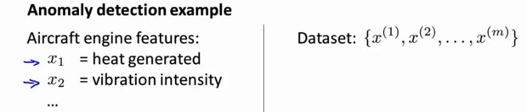

将dataset绘制成图标，如下：

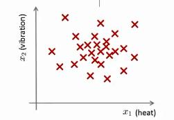

上图中每个×都是无标签数据。这样，Anormaly Detction问题就可以定义如下：假设一个新的飞机引擎生产出来，而新的飞机引擎有特征变量Xtest。所谓的异常检测问题就是：我们希望知道这个新的飞机引擎是否有某种异常。

实际上是通过高斯密度分布估计来判断样本是否有异常。

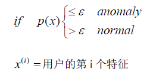

## 2.高斯分布

如果变量x符合高斯分布：

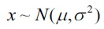

则其概率密度函数为：

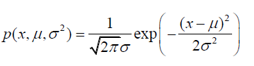

高斯分布中参数的计算如下，使用一个样本中所有的特征值计算高斯分布的参数

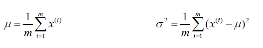

> 机器学习中，对于方差通常只除以m，而非概率统计中的(m-1)，在实际使用到底是1/m还是1/(m-1)区别很小。

高斯分布的样例如下所示：

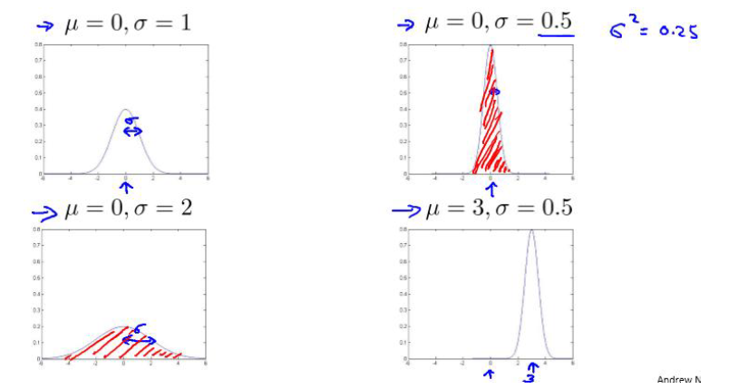

## 3.算法

**使用高斯分布开发的异常检测算法**。

对于给定数据集x^(1), x^(2),...,x^(m)，我们需要针对每一个特征计算高斯分布参数μ和σ^2的估计值。

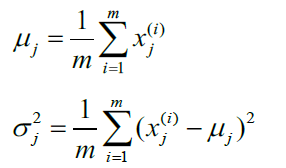

通过上述公式计算处平均值和方差的估计值。

给定一个新的训练实例，根据模型计算p(x)：

**j表示第j个特征**

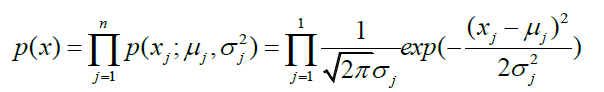

当p(x) < ξ，为异常（Anomaly）

下图是一个有两个特征的训练集，以及特征的分布情况：

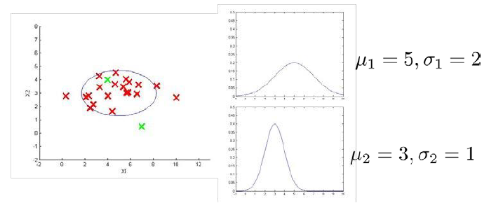

下图表示的是z轴为p(x)值的密度估计函数：

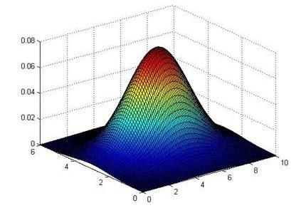

我们选择一个ξ，p(x)=ξ为判定边界。当p(x)<ξ时，为异常数据。

## 4.开发和评价一个异常检测算法

**异常检测算法是一个非监督学习算法**，意味着我们无法根据结果变量y的值来告诉我们数据是否真的是异常的。我们需要另一种方法来帮助检验算法是否有效。

当我们开发一个异常检测系统时，我们从带标记（异常或正常）的数据着手，我们从其中选择一部分正常数据用于构建训练集。

然后用剩下的正常数据和异常数据混合的数据构成交叉检验集和测试集。

train:cv:test = 6:2:2

具体的评价方法如下：

1. 根据测试集数据，我们估计特征的平均值和方差并构建p(x)函数
2. 对交叉检验集，我们尝试使用不同的ξ值作为阀值，并预测数据是否异常，根据F1值或者查准率与查全率的比例来选择ξ
3. 选出ξ后，针对测试集进行预测，计算异常检验系统的F1值，或者查准率与查全率之比

## 5.异常检测与监督学习对比

异常检测虽然是非监督学习，但是还是会使用带标记的数据，

通过以下对比来直观的显示**异常检测和监督学习的区别**：

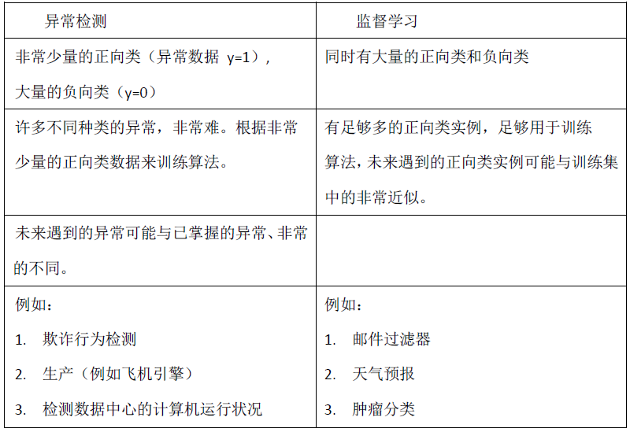

异常检测主要针对非规律小批量的异常进行检测。

## 6.特征选择

对于异常检测，特征选择至关重要。

异常检测假设特征符合高斯分布，如果数据的分布不是高斯分布，异常检测算法也能够工作，但最好将数据转化为高斯分布。

下图是一个转化实例：

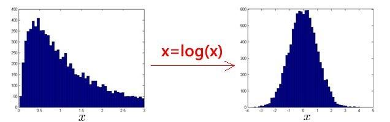

**误差分析**：一个常见的问题是一些异常的数据可能也会有较高的p(x)值，因而会被算法认为是正常的，这种情况下误差分析能够帮助我们。

通过观察那些被误判为正常的数据，我们能够找出一些问题，添加一些新的特征，更好的帮助我们进行异常检测。

## 7.多元高斯分布（选修）

假使我们有两个相关的特征，而且这两个特征的值域范围比较宽，这种情况下，一般的高斯分布模型可能不能很好地识别异常数据。

其原因在于，一般的高斯分布模型尝试的是去同时抓住两个特征的偏差，因此创造出一个比较大的判定边界。

下图中有两个相关特征，左上角绿色的 X 所代表的的数据点可能是异常值，但是其P(x)值却仍然在正常范围内（**洋红色的圈表示p(x)等高线**）。

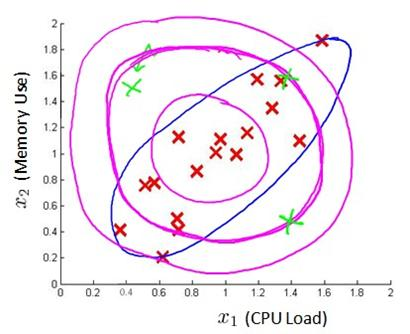

> 多元高斯分布将创建像图中蓝色曲线所判定的边界。

一般的高斯分布模型，通过计算每个特征所对应的几率然后将其累乘起来，在多元高斯分布模型中，通过构建特征的协方差矩阵，用所有特征一起来计算p(x)。

首先计算所有特征的平均值，然后计算协方差矩阵。

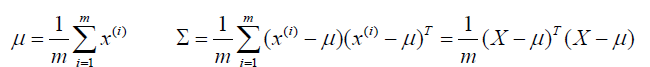

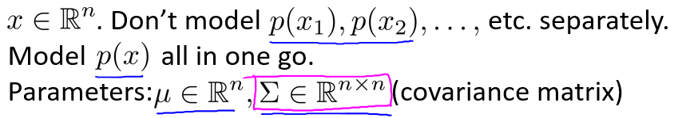

从上图可以看出，原来数据集x为 n\*m 维矩阵。因此**μ是一个n维向量**，其每一个单元都是原特征矩阵中一行数据的均值。最后我们计算多元高斯分布的p(x)为：

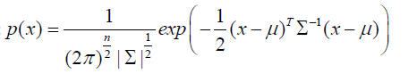

下图是用协方差矩阵对模型的影响：

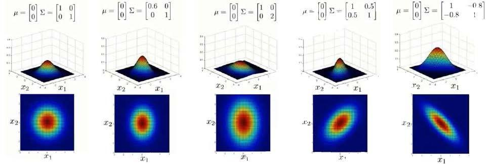

上图是五个模型：
1. 是一个一般的高斯分布模型。
2. 通过协方差矩阵，令特征1拥有较小的偏差，同时保持特征2的偏差。
3. 通过协方差矩阵，令特征2拥有较大的偏差，同时保持特征1的偏差。
4. 通过协方差矩阵，在不改变两个特征的原有偏差的基础上，增加两者之间的正相关性。
5. 通过协方差矩阵，在不改变两个特征的原有偏差的基础上，增加两者之间的负相关性。

多元高斯分布和普通高斯分布的关系：

> 普通高斯分布是多元高斯分布的一个特列，如协方差矩阵中的123所示3个图例。

```
普通高斯分布				多元高斯分布

不能捕捉特征之间的相关性，		自动捕捉特征之间的相关性
可通过特征组合进行解决

计算代价低，能始应大规模特征		计算代价高，训练集较小时也同样适用

					必须要m>n，不然协方差矩阵不可逆，
					通常要m>10n，另外特征冗余也会导致协方差
					矩阵不可逆
```

> 1. 普通高斯原高斯分布模型被广泛使用着，如果特征之间在某种程度上存在相互关联的情况，我们可以通过构造新特征的方法来捕捉这些相关性。
> 2. 如果训练集不是太大，并且没有太多的特征，我们可以使用多元高斯分布模型。
