# 一、推荐系统
通过推荐学习可以了解一部分特征学习的思想。

## 1.基于内容的推荐系统
**本质上是给内容一个参数向量x，然后给用户一个参数向量θ，找出两者乘积的最小值**。

首先引入一些标记：

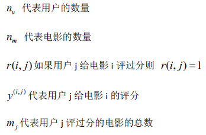

对于一个基于电影内容的推荐系统，我们假设每部电影有两个特征，并且有四个人对其其中的一些电影进行了评分。

x1代表电影的浪漫程度，x2代表电影的动作程度。

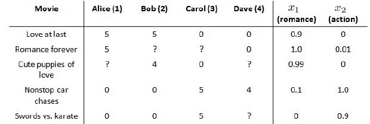

从上图可以得出每部电影都有一个特征向量，第一部的vector为[0.9, 0]。

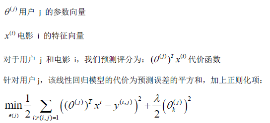

其中：
> i:r(i,j)表示我们只计算那些用户j评价过的电影。 
> 一般线性回归模型中误差和正则化项会乘以1/2m，这里将m去掉。

上边的代价函数只针对一个用户，求和所有用户代价函数用以学习所有用户。

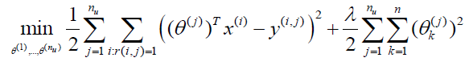

使用梯度下降来更新θ里面的参数

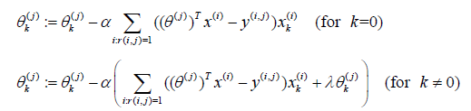

## 2.协同过滤
**与预测但参数向量（用户/电影）类似，不同的是两者都是未知数，通过算法迭代找出两者所组成代价函数的最小值**。

上边基于内容的推荐系统中，对于每一部电影，我们都掌握了可用的特征，使用这些特征训练出每一个用户的参数。

同样的，我们有每一个用户的参数，能够训练出电影的特征。

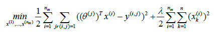

如果既没有用户参数，有没有电影特征，就使用**协同过滤**算法针对xθ进行计算。

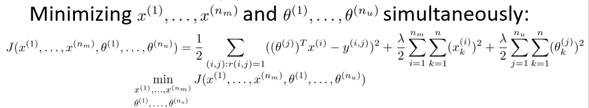

协同过滤算法：
> 1. 随机初始化用户参数θ和电影特征参数x 
> 2. 最小化j： 
> > 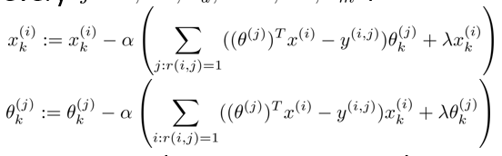 
> 3. 使用用户参数θ和电影特征x，预测θ.T * x. 

## 3.低秩矩阵分解
**计算两个内容（电影）参数向量的距离，找出具有最小距离的那个内容（电影）进行推荐**。

上一节说到了协同过滤算法，本节说一下该算法的向量化表示。

举个例子：
1. 当给出一个产品，你能否找出与之相关的其他产品。
2. 一位用户最近看上一件产品，有没有其他想管产品，可以推荐给他。

怎么做：实现一种选择的方法，写出协同过滤算法的预测情况。

第一节图片中展示了用户对电影的评分:

则可将其矩阵化：

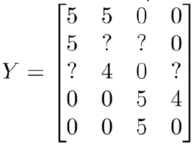

则推出评分：

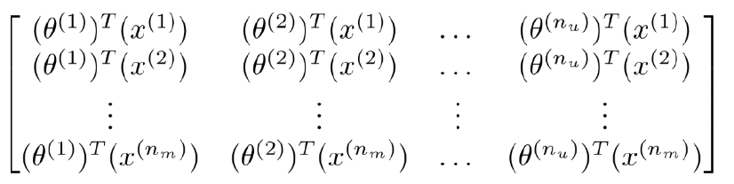

找打相关影片：

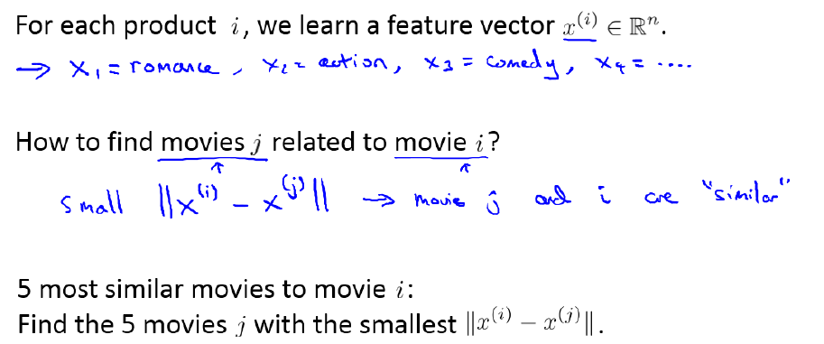

通过两个内容（电影）之间特征向量之间的最小值来寻找相似的两部内容（电影）。

## 4.均值归一化

**如何为一个新用户推荐内容（电影）**

我们首先看用户数据：

如果新增一个用户Eve，并且Eve没有为任何电影评分，那我我们如何为Eve推荐电影？

1. 对Y矩阵进行均值归一化处理，将**每一个用户对某一部电影的评分减去所有用户对该电影评分的均值**。

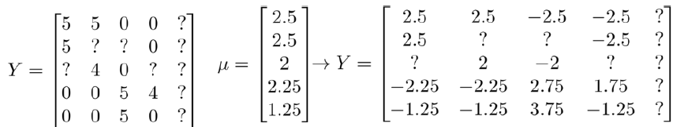

然后利用这个新的Y矩阵来训练算法。

如果我们用新训练出来的算法预测评分，则需要将平均值重新加回去，预测：

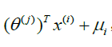

我们新模型会认为她给每个内容（电影）的评分都是平均分。

