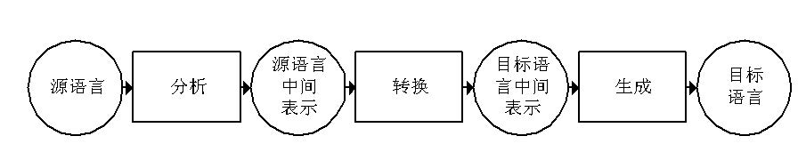
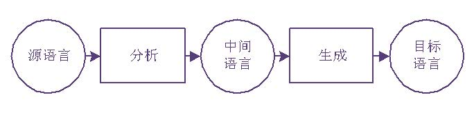
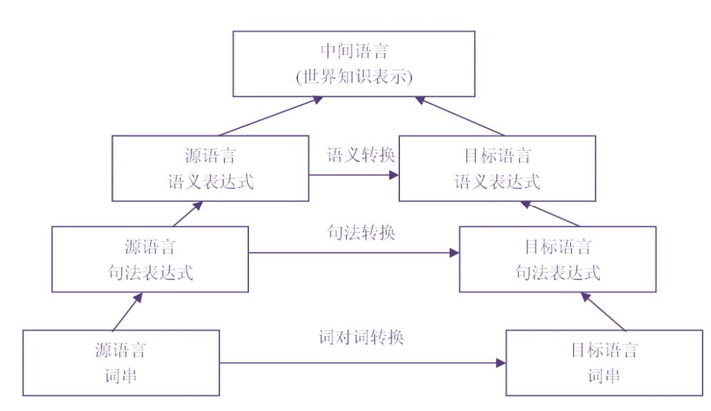
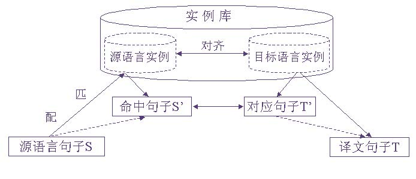

# 一、机器翻译的基本方法

##1. 基于规则的机器翻译方法
###1. 直接翻译法：逐词翻译 

###2. 转换法 

分析源语言文本，得到源语言的内部表示

将源语言的内部表示转换为目标语言的内部表示

根据目标语言的内部表示生成目标语言文本

翻译分为三个步骤：

**商业上较为成功的规则方法**

###3. 中间语言法
中间语言不同于任何具体的自然语言，是一种中间意义的语言 

翻译分为两个阶段：

优点：有效减少翻译模块的数量。n(n-1) -> 2n

缺点：中间语言定义困难

###4.基于规则的翻译方法图示

##2. 基于语料库的机器翻译方法
###1. 基于实例的方法

模仿实例库中已有的译文采用类比策略进行翻译。

1. 主要知识库是双语对照的实例库
2. 需要翻译新句子，在实例库中检索与该句子类似的翻译实例
3. 通过模拟实例的译文完成新句子翻译

###2. 基于统计的方法

通过建立、训练统计翻译模型，并进而基于统计模型进行翻译。

###3. 神经机器翻译方法

通过建立、训练深度神经网络模型完成机器翻译。

基于神经网络模型完成机器翻译。

编码器-解码器：编码器读入源语言句子，生成源语言句子向量表示，解码器基于源语言句子的向量表示生成目标语言句子。

最常用的机器翻译的评价源于ALPAC报告：
1. 可理解性：译文多大程度上为不懂原文的人所理解。
2. 忠实度：译文与原文在内容上有多大差异。

> **目前没有任何一种方法能完美实现机器翻译**

