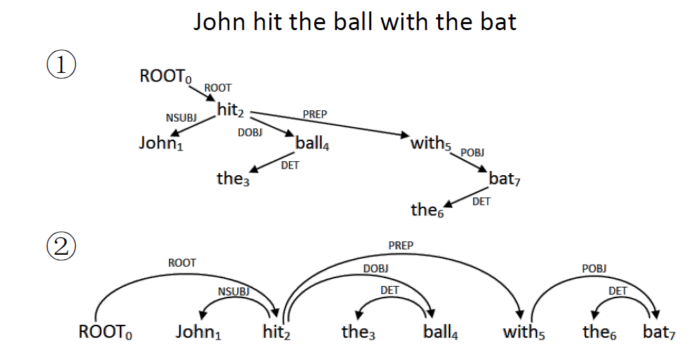
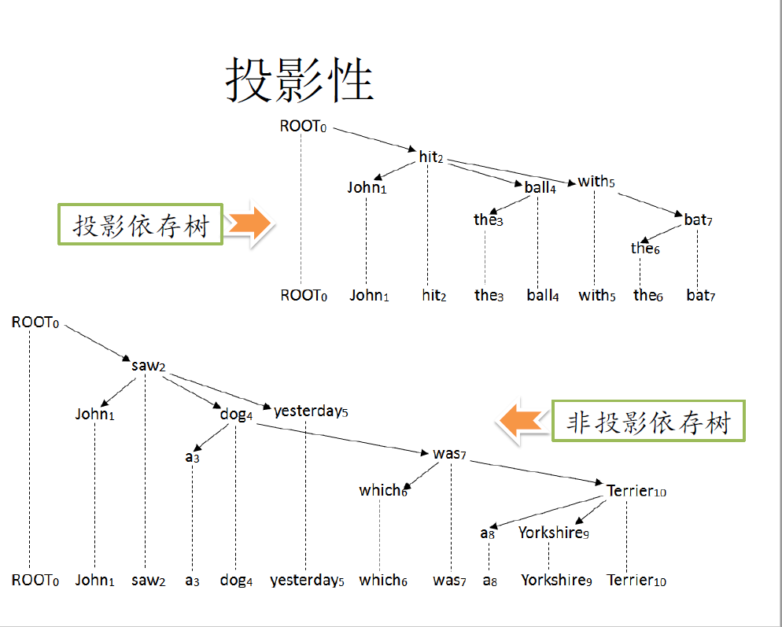
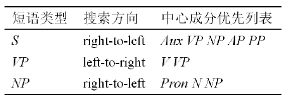
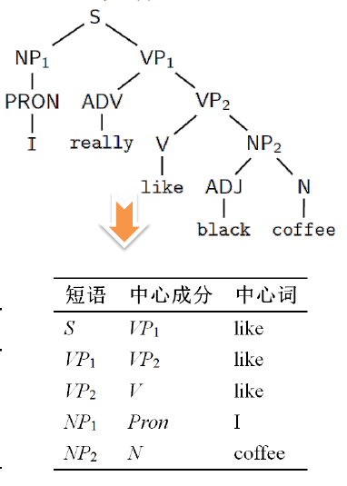
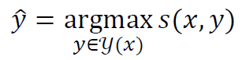
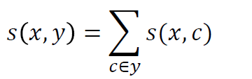
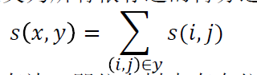
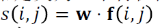
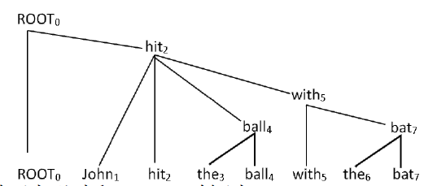

##1. 语法理论概要

**短语结构语法**描写句子成分之间的组成关系，也叫成分语法。

**依存语法**描写句子中词与此之间的依存关系。

基于CFG的句法分析是面向短语结构语法理论的句法分析。

##2. 依存句法（Dependency Parsing）

依存关系：词与词之间存在一种从属和中心的关系。
> 依存关系是一种二元非对称关系。

句子的依存结构（dependency structure）：把词视作节点，依存关系视作边，句子结构可表示成带标记的有向图，即依存图（dependency graphy）。

通常依存图遵循如下限制：
> 连通性限制 
> 单中心限制 
> 非环限制 

符合以上限制的dependency graphy is a dependency tree。只有根节点没有与之关联的中心词。为了处理方便，通常人为添加一个特殊的词ROOT作为根节点的中心词。

依存树表示：

> NMOD表示一种修饰关系 
> DOBJ表示一种动词宾语关系 

投影性（projectivity）：依存弧可以表示为三元组（head，lable，dependent）
> 例如：(hit, NSUBJ, John), (hit, DOBJ, ball)

令Wi为依存树中的节点，称Wi沿着依存弧可到达的节点（词）为Wi的投影（projection）。

投影性条件：若Wi在依存树中的所有投影组成句子中的连续字串，则称该节点满足投影性条件。

若依存树中所有节点满足投影性条件，则依存树称为投影性依存树，否则称为非投影依存树。

**依存语法更适合语序自由的语言，如汉语、英语中的非投影结构较少**

##3. 从短语结构树到依存树

短语结构树中通常不会标记词和词之间的依存关系。

可以通过启发式规则(heuristics)确定成分的中心(head)成分。

中心成分规则(Head rules)给定：𝑋→𝑌1𝑌2⋯𝑌𝑛怎样确定中心成分𝑌𝑖?

例子：

## 4.依存句法分析

对给定的自然语言句子，分析并得到其依存句法树。

依存句法分析的主要方法
1. 基于图的依存分析
2. 基于转移的依存分析

模型：寻找地分最高的依存树

x是待分析的句子，y(x)是所有可能的依存树，s(x,y)是分析依存树y的地分。

## 5. 基于图的依存分析

评分模型（scoring model）：计算依存树得分s(x,y)

分析算法（parsiing algorithm)：搜索得分最高的依存树

1. 评分模型

将依存树分解为子图（用c表示），子图独立评分，依存树得分定义为子图得分之和。

分解子图的做法：

**弧-分解模型(arc-factored model)（一阶模型）**
> 1. 子图定义为依存边，依存树分解为依存边的集合。 
> 2. 依存树的得分定义为所有依存边的得分之和。 
> >  
> > (i,j)为树中的依存边，即依存树中存在依存边xi -> xj 
> 3. 计算依存边得分 
> > 依存边的得分通常定义为一个特征向量与权重向量的内积，即 
> >  
> > s(i,j) 不等于 s(j,i)

计算边(i,j)的得分，需要针对依存边提取特征。

权重向量w是模型参数，需通过依存树库训练得到。

2. 分析算法

依存分析可被视作据有向图求解最大生成树(Maximum Spanning Tree)的问题。

给定句子𝑥,构造带权有向图𝐺𝑥=(𝑉𝑥,𝐸𝑥),其中：

· 结点集合：𝑉𝑥={𝑥0=ROOT,𝑥1,𝑥2,···,𝑥𝑛}

· 有向边集合：𝐸𝒙={(𝑖,𝑗): 𝑥𝑖≠𝑥𝑗, 𝑥𝑖∈𝑉𝒙, 𝑥𝑗∈𝑉𝒙−ROOT}

· 边(𝑖,𝑗)的权值为𝑠(𝑖,𝑗)
•
𝐺𝑥的**生成树**𝐺𝑥′=(𝑉𝑥′,𝐸𝑥′)，其中：
> 1. 𝑉𝑥′=𝑉𝑥, 𝐸𝑥′属于 𝐸𝑥 
> 2. 结点ROOT的入度为0，其余结点的入度为1

𝐺𝑥的**最大生成树**：𝐺𝑥生成树中权值最大的树。

对于投影结构依存树，需要满足投影性条件。可采用CKY算法、Eisner算法。

**CKY算法**

依存树可以转换为一种词汇化的短语结构树。
> 1. 叶子结点是句中的词
> 2. 分支结点是相应成分的中心词

因此可通过CKY算法进行句法分析(Viterbi算法)。

CKY算法的时间复杂度𝑂(𝑛^3 * |𝐺|)，其中|𝐺|是文法规模

句子中任何两个词都可对应两条规则

the -> the bat, bat -> the bat

利用CKY算法进行依存分析，时间复杂度是O(n^5)

**Eisner算法**

## 6.基于转移的依存分析

在短语结构句法分析中，常采用移入-归约(shift-reduce)策略进行句法分析。依存句法分析，也可以采用类似的策略。

依存树是通过执行一个分析动作序列逐步构造出来的。

句法分析始于一个初始格局(configuration)，应用分析动作后，产生新的格局，再应用分析动作，又产生更新的格局，……。

分析过程表现为一种格局转移过程，所以称为基于转移的依存分析。（transition-based dependency parsing）

待分析的句子为𝑥 = 𝑥0 𝑥1 ··· 𝑥𝑛

**分析格局**𝑐=(𝜎,𝛽,𝐴)，其中：

𝜎是分析栈，存放处理中的结点(词)。

𝛽是输入缓冲区，存放尚未处理的结点(词)。

𝐴是依存弧的集合，代表分析过程中得到的部分依存树。

**基于转移的系统**是一个四元组𝑆=(𝐶,𝑇,𝑐,𝐶𝑡)，其中：

𝐶是分析格局的集合

𝑇是分析动作的集合

𝑐是初始格局，通常𝑐(𝑥)=([𝑥0],[𝑥1𝑥2⋯𝑥𝑥𝑛𝑛],∅)

𝐶𝑡是终止格局集合，通常𝐶𝑡={𝑐|𝑐=(𝜎,[],𝐴),𝑐∈𝐶}

